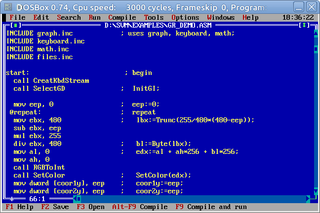
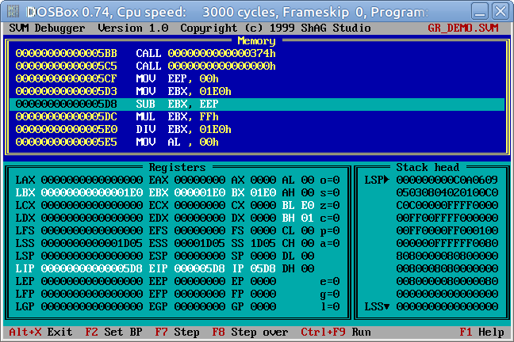
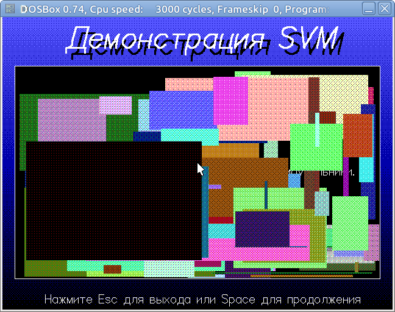

ShAG Virtual Machine
====================

It's one of my very first projects I did at my childhood. Recently I 
found it in my archives and decided make it public. It was developed 
in 98-99 with using Turbo Pascal 7.0. These were the last years of 
school. Internet was quite empty these days. I didn't found the way
to share this code in time.

The project contains virtual machine inspired by article about Java. 
It was 97 when I read about it first time. The idea about executing 
application in different environments surprized me. I didn't found 
much more detalis and wasn't able to get JVM. But I really wanted to 
see how it works. 

So, I've started this project to proof the idea for myself. The code 
completely developed at 80286 PC and then tested with newer systems. 
It still works at DOSBox in my Ubuntu. These files you could find
in project:

  /dist - bundle to install the project
  /docs - some documents
  /src - source code
  /src/svml - runtime loader of byte-code
  /src/svmd - interactive debugger
  /src/svmac - compiler
  /src/svmasm - simple IDE like Turbo Pascal with built-in documentation
  /src/sfp - simple archiver used to build setup bundle
  /src/installer - installer application
  /src/units - all Pascal units required to build applications
  /src/fonts - fonts to be used in graphics mode
  /src/includes - a few libraries to write code for virtual machine
  /src/examples - a few simple programs for virtual machine
  
The IDE looks pretty simple, but has built-in documentation:

Debugger is also very simplified and provide basic features:

There is a few examples to show how it works. For example:

The code developed in times of MS-DOS, so default enconding is CP866 
with comments in Russian. You have to configure DOSBox to this encoding
to read documentation.
